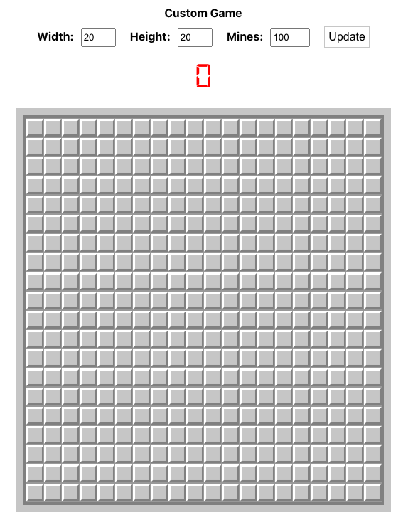

# Minesweeper Game

Minesweeper is a classic puzzle game where the player must locate and flag all the mines hidden under a grid of squares without detonating any of them. This implementation is built with React and provides a customizable grid size and number of mines.



## Features
- Customizable grid size and number of mines.
- Timer to track game duration.
- Game over and win alerts.

## How to Run

### Prerequisites

Ensure you have the following installed:

- Node.js (https://nodejs.org)
- npm (Node package manager, comes with Node.js)

### Installation

1. Clone the repository:

    ```sh
    git clone https://github.com/semenets/minesweeper
    cd minesweeper
    ```

2. Install the dependencies:

    ```sh
    npm install
    ```
### Running the App

1. Start the development server:

    ```sh
    npm start
    ```

2. Open your browser and navigate to `http://localhost:3000` to see the minesweeper in action.

### Build for Production

To create an optimized build of the app for production:

```sh
npm run build
